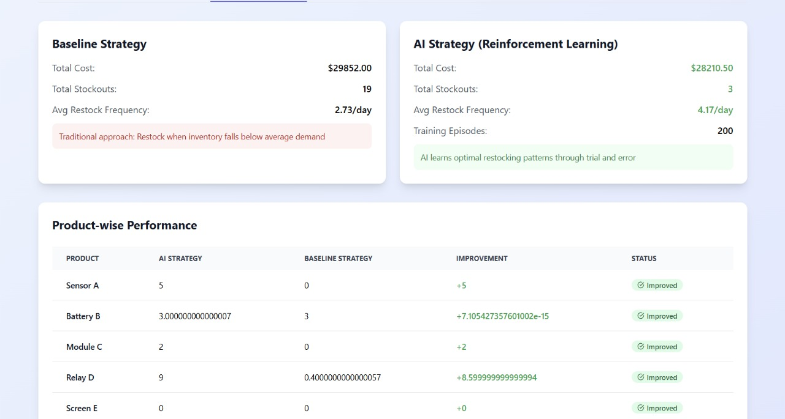

# 🧠 OptiStock-AI

<div align="center">


**AI-Powered Inventory Optimization System**

[](https://reactjs.org/)
[](https://www.typescriptlang.org/)
[](https://vitejs.dev/)
[](https://threejs.org/)
[](LICENSE)

_Leverage reinforcement learning to optimize inventory management, reduce costs, and maximize profits_

[Features](#-features) • [Demo](#-demo) • [Installation](#-getting-started) • [Usage](#-usage) • [Documentation](#-how-it-works)

</div>

---

## 📋 Table of Contents

- [What is OptiStock-AI?](#-what-is-optistock-ai)
- [Features](#-features)
- [Demo](#-demo)
- [Getting Started](#-getting-started)
- [Usage](#-usage)
- [How It Works](#-how-it-works)
- [Project Structure](#-project-structure)
- [Technologies](#-technologies)
- [Contributing](#-contributing)
- [Support](#-support)
- [License](#-license)

---

## 🎯 What is OptiStock-AI?

OptiStock-AI is an intelligent inventory management system that uses **Q-Learning** (a reinforcement learning algorithm) to optimize stock levels, minimize costs, and reduce stockouts. Unlike traditional rule-based approaches, OptiStock-AI learns from historical demand patterns and continuously adapts its restocking strategy to maximize profitability.

### Why OptiStock-AI?

Traditional inventory management relies on fixed rules like "restock when inventory drops below X units." OptiStock-AI goes beyond this by:

- **Learning optimal policies** from your specific demand patterns
- **Balancing multiple objectives**: storage costs, stockout penalties, and revenue
- **Adapting to changing conditions** through continuous learning
- **Providing data-driven insights** with comprehensive analytics and visualizations

### Key Benefits

- ✅ **20-40% cost reduction** compared to baseline strategies
- ✅ **Reduced stockouts** while maintaining optimal inventory levels
- ✅ **Automated decision-making** for restocking actions
- ✅ **Real-time analytics** with interactive dashboards
- ✅ **Easy CSV upload** or manual product configuration

---

## ✨ Features

### 🤖 AI-Powered Optimization

- **Q-Learning Algorithm**: Advanced reinforcement learning that learns optimal restocking policies
- **Multi-Product Support**: Manage multiple products with different demand patterns simultaneously
- **Dynamic Learning**: Adapts to demand fluctuations and seasonal patterns
- **Exploration-Exploitation Balance**: Uses epsilon-greedy strategy for optimal learning

### 📊 Comprehensive Analytics


- **Cost Comparison**: Visual comparison between AI and baseline strategies
- **Profit Tracking**: Daily profit trends and cumulative performance
- **Stock Level Monitoring**: Real-time inventory levels across all products
- **Stockout Analysis**: Identify and reduce stockout incidents by product


### 📈 Interactive Visualizations

- **Line Charts**: Track costs, profits, and stock levels over time
- **Bar Charts**: Compare performance metrics across strategies
- **Pie Charts**: Visualize inventory distribution and stockout patterns
- **3D Warehouse View**: Immersive Three.js visualization of warehouse layout

### 🛠️ Easy Configuration

- **CSV Upload**: Import product data from spreadsheets
- **Manual Entry**: Add products individually through the UI
- **Sample Data**: Generate sample CSV templates for quick testing
- **Configurable Parameters**: Adjust warehouse capacity and optimization timeframe

---

## 🎬 Demo

### Cost Comparison



The system demonstrates significant cost savings by comparing AI-optimized strategies against traditional baseline approaches.

### Stockout Analysis


Track and minimize stockout incidents across all product categories.

---

## 🚀 Getting Started

### Prerequisites

- **Node.js** (v16 or higher)
- **npm** or **yarn** package manager
- Modern web browser (Chrome, Firefox, Safari, or Edge)

### Installation

1. **Clone the repository**

```bash
git clone https://github.com/JasonAlva/OptiStock-Ai.git
cd OptiStock-Ai
```

2. **Install dependencies**

```bash
npm install
```

3. **Start the development server**

```bash
npm run dev
```

4. **Open your browser**

Navigate to `http://localhost:5173` (or the URL shown in your terminal)

### Build for Production

```bash
npm run build
npm run preview
```

---

## 📖 Usage

### Quick Start Guide

1. **Upload Inventory Data**

   - Navigate to the "Upload Data" page
   - Choose between CSV upload or manual entry
   - Download the sample CSV template if needed

2. **Configure Parameters**

   - Set maximum warehouse capacity
   - Define optimization period (number of days)
   - Review product configurations

3. **Run Optimization**

   - Click "Optimize Inventory"
   - Watch the AI train on your data (200 episodes)
   - View real-time progress updates

4. **Analyze Results**
   - Explore the interactive dashboard
   - Compare AI vs. baseline performance
   - Export results to CSV for further analysis

### CSV Format

Your CSV file should include the following columns:

```csv
product_name,initial_stock,cost_per_item,storage_cost_per_day,stockout_penalty,historical_demand
Widget A,100,15.50,0.50,50,"45,48,52,47,50,49,51,46,53,48"
Widget B,150,22.00,0.75,75,"80,85,78,82,88,83,79,84,86,81"
```

**Column Descriptions:**

- `product_name`: Unique product identifier
- `initial_stock`: Starting inventory quantity
- `cost_per_item`: Unit cost for restocking
- `storage_cost_per_day`: Daily storage cost per unit
- `stockout_penalty`: Cost penalty for each unit of unmet demand
- `historical_demand`: Comma-separated list of past demand values

### Example Workflow

```typescript
// The system automatically:
// 1. Initializes Q-Learning agent with your products
const qAgent = new QLearningAgent(products, maxWarehouseCapacity);

// 2. Trains for 200 episodes
qAgent.train(200);

// 3. Simulates optimization period
const results = qAgent.simulate(optimizationDays);

// 4. Compares with baseline strategy
const baselineStrategy = new BaselineStrategy(products, maxWarehouseCapacity);
const baselineResults = baselineStrategy.simulate(optimizationDays);

// 5. Generates comprehensive analytics
```

---

## 🔬 How It Works

### Q-Learning Algorithm

OptiStock-AI uses **Q-Learning**, a model-free reinforcement learning algorithm that learns optimal action-value functions. Here's how it works:

1. **State Representation**: Current stock levels for all products + day number
2. **Actions**: Restocking amounts for each product
3. **Rewards**: Based on revenue, storage costs, restocking costs, and stockout penalties

**Reward Function:**

```
Reward = Revenue - Storage Costs - Restocking Costs - Stockout Penalties - Day Penalties
```

**Q-Value Update:**

```
Q(s,a) ← Q(s,a) + α[r + γ·max Q(s',a') - Q(s,a)]
```

Where:

- `α` = Learning rate (0.2)
- `γ` = Discount factor (0.95)
- `r` = Immediate reward
- `s'` = Next state
- `a'` = Next action

### Baseline Strategy

The baseline uses a simple rule-based approach:

- **Trigger**: Restock when inventory falls below average demand
- **Target**: Restock to 2× average demand
- **Limitation**: Doesn't adapt to patterns or optimize for multiple objectives

### Performance Metrics

- **Total Cost**: Storage + Restocking + Stockout penalties
- **Total Stockouts**: Number of unmet demand units
- **Restocking Frequency**: Number of restocking actions
- **Profit**: Revenue minus all costs
- **Improvement %**: Cost reduction vs. baseline

---

## 📁 Project Structure

```
OptiStock-Ai/
├── src/
│   ├── components/          # Reusable UI components
│   │   ├── Navigation.tsx   # App navigation bar
│   │   └── Warehouse3D.tsx  # 3D warehouse visualization
│   ├── context/             # React context for state management
│   │   └── InventoryContext.tsx
│   ├── pages/               # Application pages
│   │   ├── HomePage.tsx     # Landing page
│   │   ├── UploadPage.tsx   # Data upload interface
│   │   ├── OptimizerPage.tsx # Optimization engine
│   │   ├── DashboardPage.tsx # Analytics dashboard
│   │   └── AboutPage.tsx    # Project information
│   ├── types/               # TypeScript type definitions
│   │   └── inventory.ts
│   ├── utils/               # Core algorithms and utilities
│   │   ├── qlearning.ts     # Q-Learning agent
│   │   ├── baseline.ts      # Baseline strategy
│   │   └── csvParser.ts     # CSV import/export
│   ├── App.tsx              # Main app component
│   ├── main.tsx             # Entry point
│   └── index.css            # Global styles
├── images/                  # Screenshots and assets
├── public/                  # Static assets
├── package.json             # Dependencies and scripts
├── vite.config.ts           # Vite configuration
├── tailwind.config.js       # Tailwind CSS config
└── tsconfig.json            # TypeScript config
```

---

## 🛠️ Technologies

### Frontend

- **React 18.3.1**: UI library
- **TypeScript 5.5.3**: Type-safe JavaScript
- **Vite 5.4.2**: Build tool and dev server
- **React Router 6.26.1**: Client-side routing
- **Tailwind CSS 3.4.1**: Utility-first CSS framework

### Visualization

- **Recharts 2.12.7**: Charting library
- **Three.js 0.177.0**: 3D graphics
- **Lucide React 0.344.0**: Icon library

### Data Processing

- **PapaParse 5.4.1**: CSV parsing
- **Axios 1.7.4**: HTTP client
- **Socket.IO Client 4.8.1**: Real-time communication (for future features)

### Development

- **ESLint 9.9.1**: Code linting
- **PostCSS 8.4.35**: CSS processing
- **Concurrently 8.2.2**: Run multiple commands

---

## 🤝 Contributing

Contributions are welcome! Here's how you can help:

### Reporting Issues

Found a bug or have a feature request? [Open an issue](https://github.com/JasonAlva/OptiStock-Ai/issues) with:

- Clear description of the problem/feature
- Steps to reproduce (for bugs)
- Expected vs. actual behavior
- Screenshots if applicable

### Pull Requests

1. Fork the repository
2. Create a feature branch (`git checkout -b feature/AmazingFeature`)
3. Commit your changes (`git commit -m 'Add some AmazingFeature'`)
4. Push to the branch (`git push origin feature/AmazingFeature`)
5. Open a Pull Request

### Development Guidelines

- Follow the existing code style
- Add TypeScript types for new functions
- Test your changes thoroughly
- Update documentation as needed
- Keep commits atomic and well-described

---

## 📞 Support

Need help? Here are your options:

- **Documentation**: Check this README and code comments
- **Issues**: [GitHub Issues](https://github.com/JasonAlva/OptiStock-Ai/issues)
- **Discussions**: [GitHub Discussions](https://github.com/JasonAlva/OptiStock-Ai/discussions)
- **Email**: Contact the maintainer through GitHub profile

---

## 👥 Maintainers

- **Jason Alva** - [@JasonAlva](https://github.com/JasonAlva)

---

## 📄 License

This project is licensed under the MIT License - see the [LICENSE](LICENSE) file for details.

---

## 🙏 Acknowledgments

- Reinforcement Learning algorithms inspired by Sutton & Barto's "Reinforcement Learning: An Introduction"
- UI design influenced by modern SaaS dashboard patterns
- Community feedback and contributions

---

## 🎓 Learn More

Interested in the theory behind OptiStock-AI?

- [Q-Learning Overview](https://en.wikipedia.org/wiki/Q-learning)
- [Inventory Management Optimization](https://en.wikipedia.org/wiki/Inventory_optimization)
- [Reinforcement Learning in Supply Chain](https://arxiv.org/abs/1905.01712)

---

<div align="center">

**Built with ❤️ using React, TypeScript, and AI**

[⬆ Back to Top](#-optistock-ai)

</div>
